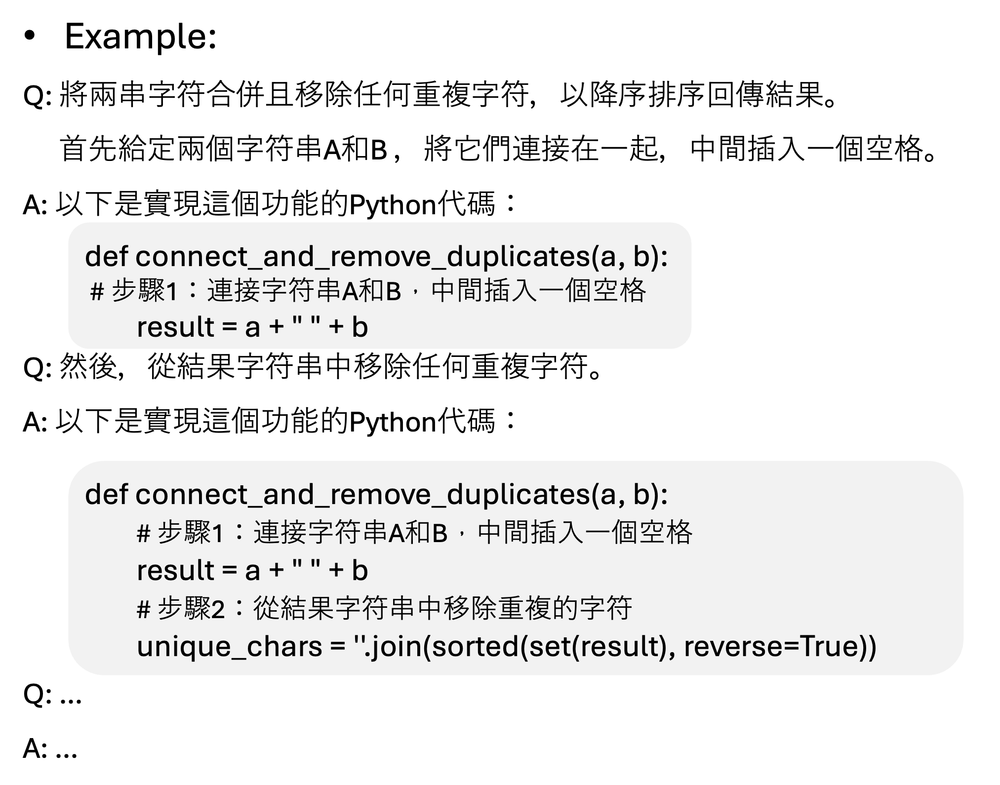
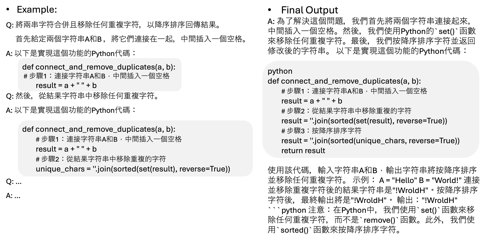

# Mandarin Auto-Coder

The Mandarin Auto-Coder project aims to develop a Mandarin Large Language Model (LLM) tailored for coding questions. This initiative seeks to bridge the language gap in coding education, offering Mandarin speakers accessible and effective coding solutions and instructions.

## Baseline Model

We selected [TAIDE](https://huggingface.co/taide) as the baseline LLM for fine-tuning. TAIDE is a Mandarin-based LLM capable of performing five tasks: summarization, letter writing, essay writing, English-to-Chinese translation, and Chinese-to-English translation.

## Data Preprocessing

The [Tested-22k-Python-Alpaca](https://huggingface.co/datasets/Vezora/Tested-22k-Python-Alpaca) dataset was utilized for this project. We translated selected examples from the dataset into Mandarin, cleaned the data by removing non-functional code, and reformatted it into a chain-of-thought structure.

## Few-Shot Prompting

Few-shot prompting involves providing the LLM with a few example inputs and outputs to guide its responses. This approach helps the model understand the format and context of the task, improving its performance on coding-related questions. We curated a set of example coding questions and their solutions in Mandarin, using these examples to fine-tune the model's ability to generate accurate and contextually appropriate responses.

## Chain-of-Thought Prompting

Chain-of-thought prompting enhances the model's reasoning by breaking down complex problems into a series of intermediate steps. This method involves guiding the model to think through the problem systematically, improving its ability to generate coherent and logically sound solutions. Below is an example of how chain-of-thought prompting is applied:

## Quantization and Low-Rank Adapters

To optimize the model for deployment, we implemented quantization and low-rank adapters. Quantization reduces the model size by converting weights from floating-point to lower-precision formats, which decreases memory usage and increases inference speed without significantly impacting performance. Low-rank adapters, on the other hand, add a small number of trainable parameters to the model, enabling efficient fine-tuning and adaptation to specific tasks while keeping the original model weights fixed. These techniques make the Mandarin Auto-Coder more efficient and accessible for various applications.

## Sample Output

Below is a sample output generated by the Mandarin Auto-Coder:

For further details on the implementation and usage of the model, please refer to the [code](https://github.com/Dawson-ma/Auto-Coder-in-Madarin/blob/main/ProfessionalCoderInMadarin.ipynb) provided.
